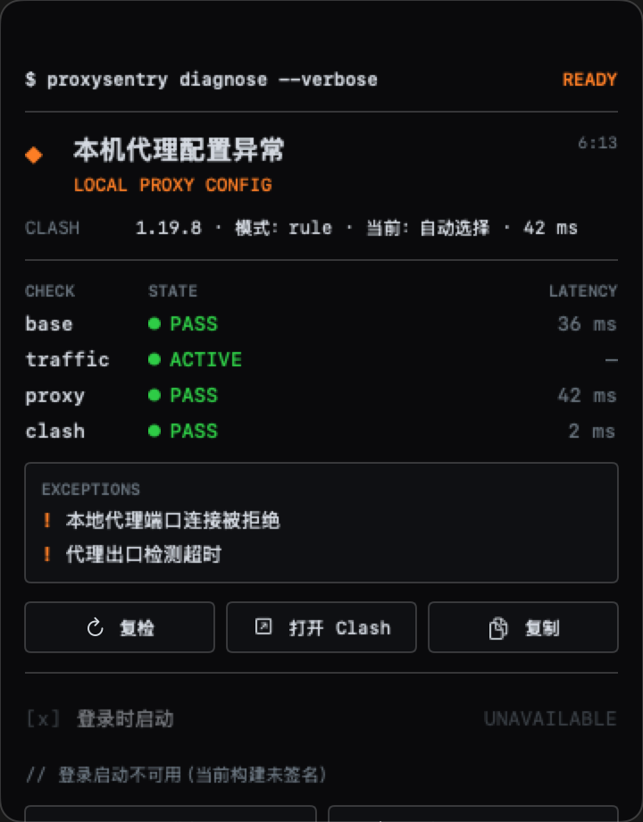

# ProxySentry

一眼判断“网络不好”到底坏在哪一层。

ProxySentry 是一款轻量、只读的 macOS 网络诊断工具。它把基础网络、代理流量、当前节点和 Clash 内核拆成四层证据，并把结果收纳在刘海或屏幕顶部；不切换节点，不修改代理配置。

[下载 2.0 未签名预览版](https://github.com/justinjia0813/ProxySentry/releases/tag/preview-v2.0.0) · [查看全部版本](https://github.com/justinjia0813/ProxySentry/releases) · [报告问题](https://github.com/justinjia0813/ProxySentry/issues)



> [!IMPORTANT]
> GitHub 上提供的是 2.0.0 未签名预览包。它没有 Developer ID（Developer Identifier，开发者标识；Apple 用来识别独立开发者签名身份）签名，也没有通过 Apple 公证，macOS Gatekeeper 会拦截它。现阶段适合开发测试，不是面向普通用户的免提示安装包。

## 2.0 有什么不同

- 不占用菜单栏或 Dock；有刘海时收进刘海区域，无刘海显示器退化为顶部居中胶囊。
- 鼠标移入时展开，离开、外部点击或按 Escape 后收起。
- 网络变化只在后台复检，不因短暂波动打断用户；异常连续至少 3 分钟才主动提示一次，恢复后才允许再次提醒。
- 使用终端风格的高对比界面，同时适配深色、浅色、多屏、全屏 Space、长文本和 VoiceOver。
- 只使用公开 AppKit 接口，不申请辅助功能权限，不使用 macOS 私有窗口接口。

## 下载与安装

下载当前预览版：

1. 打开 [ProxySentry 2.0.0 Preview](https://github.com/justinjia0813/ProxySentry/releases/tag/preview-v2.0.0)。
2. 在 **Assets** 中下载 macOS 通用构建，而不是 GitHub 自动生成的源码压缩包。
3. 解压，将 `ProxySentry.app` 拖入“应用程序”，然后打开。

当前公开包的文件名带有 `-unsigned`，代表它是未签名预览版。若要试用，请右键应用并选择“打开”；必要时前往“系统设置 → 隐私与安全性”确认。详见 [Apple 的安全设置说明](https://support.apple.com/guide/mac-help/mh40616/mac)。不要通过关闭 Gatekeeper 或运行来源不明的解除隔离命令来安装。

签名且公证通过的正式版发布后，下载入口会切换到 GitHub 的 Latest Release。

## 四层诊断

| 检查项 | 回答的问题 | `WAIT` 代表什么 |
| --- | --- | --- |
| `base` | 网卡、默认网关和直连公网是否正常？ | 证据仍不足或检测尚未完成。 |
| `traffic` | 是否观察到 Clash 正在承载非直连连接？ | 暂时没有观察到代理流量，不等于失败。 |
| `proxy` | 当前代理节点能否连通，延迟如何？ | 暂时无法形成可靠结论。 |
| `clash` | Clash Verge Rev 的 Mihomo 内核和本地接口是否可用？ | 内核状态尚未确认。 |

状态颜色保持一致：绿色正常，橙色需要关注，红色故障，灰色未知。面板同时保留异常摘要，避免只有颜色没有原因。

## 隐私与权限

ProxySentry 只做诊断：

- 不切换节点，不修改 Clash 配置，不接管系统代理。
- 只读访问 Clash Verge Rev 的本地 Unix socket，并只读取白名单接口的聚合结果。
- 不上传或持久化原始连接、节点名称、订阅地址、访问密钥或原始响应。
- 仅在运行期间周期性探测 Apple 中国站、百度、Google、Cloudflare，以及 `1.1.1.1:443` 和 `223.5.5.5:443`。Domain Name System（DNS，域名系统；把域名解析为网络地址）或目标站点策略可能影响检测结果。

ProxySentry 不是 Clash Verge Rev 官方产品，与 Clash Verge Rev、Mihomo、Apple、百度、Google、Cloudflare 或阿里云均无官方关联或背书。

## 系统要求

- macOS 13 或更高版本。
- Apple 芯片与 Intel 芯片；发布包为 `arm64` 和 `x86_64` 通用构建。
- 当前明确支持 Clash Verge Rev；其他 Clash 客户端和自定义 socket 路径尚未承诺兼容。

## 从源码构建

需要 Xcode 和 macOS 开发工具：

```sh
xcodebuild -project ProxySentry.xcodeproj -scheme ProxySentry -configuration Debug \
  CODE_SIGNING_ALLOWED=NO CODE_SIGNING_REQUIRED=NO
```

生成与项目版本一致的未签名本地预览包：

```sh
./scripts/package-release.sh
```

脚本会检查通用架构、macOS 13.0 最低版本，并在 `dist/` 生成压缩包和 Secure Hash Algorithm 256-bit（SHA-256，256 位安全散列算法；用于核对下载文件是否被改动）校验文件。本地构建不等于 Developer ID 签名或 Apple 公证。

## 发布可信度

截至 2026-08-31：

| 项目 | 状态 |
| --- | --- |
| 2.0 源码与通用构建 | 已完成 |
| GitHub Release 下载入口 | `preview-v2.0.0` 未签名预览版 |
| Developer ID 签名 | 未完成；本机没有可用签名身份 |
| Apple 公证与票据装订 | 未完成 |
| Gatekeeper 验证 | 当前公开包会被拒绝 |
| 自动更新 | 暂无 |

只有在最终上传的同一份应用完成 Developer ID 签名、Apple 公证、票据装订，并通过签名与 Gatekeeper 检查后，才会标记为正式发布。详细证据和发布门槛见 [发布合规审计](docs/release-distribution-audit.md)。

## 参与贡献

欢迎提交 [Issue](https://github.com/justinjia0813/ProxySentry/issues) 和 Pull Request。提交前请运行相关测试和 `git diff --check`；不要提交 Clash 访问密钥、订阅地址、原始连接日志或个人信息。更多约定见 [CONTRIBUTING.md](CONTRIBUTING.md) 和 [SECURITY.md](SECURITY.md)。

## 许可证

项目采用 [Massachusetts Institute of Technology License（MIT License，麻省理工学院许可证；允许使用、修改和再分发的宽松开源许可证）](LICENSE)。
